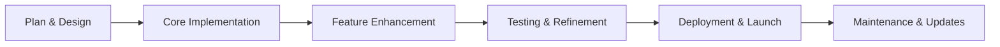
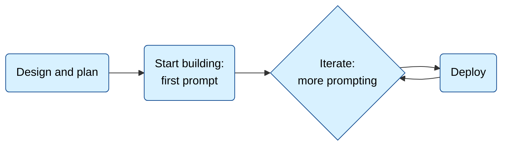

Effective planning is the foundation of successful application development. This guide helps you structure your thinking, define requirements, and create a roadmap for building your application with CodinIT.

## The Application Development Lifecycle



## Step 1: Define Your Vision

### What Problem Are You Solving?

**User-Centric Approach:**

- Identify your target users and their needs
- Understand the problem you're solving
- Define success criteria from the user's perspective

**Market Research:**

- Analyze similar applications
- Identify unique value propositions
- Understand competitive landscape

### Application Scope

**Core Functionality:**

- Define must-have features
- Prioritize based on user needs
- Avoid feature creep in initial planning

**Technical Requirements:**

- Choose appropriate technology stack
- Consider scalability needs
- Plan for future extensibility

## The lifecycle of an application



### Platform Selection

**Web Applications:**

- Browser-based interactive applications
- User-generated content and data management
- Real-time features and collaboration
- Examples: dashboards, social platforms, productivity tools

**Websites:**

- Content-focused experiences
- Marketing and informational sites
- Portfolio and showcase websites
- Examples: blogs, landing pages, documentation sites

**Mobile Applications:**

- Native mobile experiences
- Device-specific features and capabilities
- App store distribution
- Examples: fitness trackers, messaging apps, utilities

### Feature Prioritization

**Must-Have Features (MVP):**

- Core functionality that defines your product
- Essential user workflows
- Basic user interface and experience

**Should-Have Features:**

- Important but not critical functionality
- Enhanced user experience elements
- Advanced features for power users

**Nice-to-Have Features:**

- Quality-of-life improvements
- Advanced capabilities
- Future enhancement opportunities

## Step 2: Technical Planning

### Technology Stack Selection

**Frontend Technologies:**

- React for interactive web applications
- Vue.js for progressive web apps
- HTML/CSS/JavaScript for simpler websites
- React Native for cross-platform mobile apps

**Backend Considerations:**

- Supabase for full-stack applications
- API integrations for specific services
- Serverless functions for dynamic features

### Architecture Decisions

**Data Management:**

- Local storage for simple applications
- Supabase for complex data requirements
- External APIs for specialized functionality

**State Management:**

- React Context for small applications
- Zustand or Redux for complex state needs
- URL state for shareable application states

## Step 3: Create Your Implementation Plan

### Use Discussion Mode for Planning

**Strategic Planning:**

- Use discussion mode to explore different approaches
- Get guidance on architecture decisions
- Understand technical trade-offs
- Plan your development roadmap

**Iterative Development:**

- Start with core functionality
- Add features incrementally
- Test and validate each step
- Refine based on user feedback

### Example Application Plan

**Todo Application with Time Blocking:**

**Core Features:**

- Task creation and management
- Time blocking calendar integration
- Pomodoro timer functionality
- Progress tracking and analytics

**Technical Stack:**

- React for the frontend
- Supabase for data persistence
- Modern CSS for styling
- Responsive design for all devices

**Development Phases:**

1. Basic task CRUD operations
2. Calendar integration for time blocking
3. Pomodoro timer implementation
4. Progress visualization
5. Mobile optimization

## Step 4: Write Effective Prompts

### Prompt Structure Best Practices

**Clear Project Description:**

```
Build a task management application for productivity enthusiasts who use time-blocking and Pomodoro techniques.
```

**Specific Requirements:**

```
Include features for:
- Creating, editing, and deleting tasks
- Time-blocking calendar integration
- Pomodoro timer with customizable intervals
- Progress tracking and statistics
```

**Technical Specifications:**

```
Use React with TypeScript, Supabase for backend, and implement responsive design for mobile and desktop.
```

### Example Complete Prompt

**Well-Structured Prompt:**

```
Create a comprehensive task management application for productivity enthusiasts. The app should help users implement time-blocking and Pomodoro techniques effectively.

Key Features:
1. Task Management: Create, edit, delete, and organize tasks
2. Time Blocking: Visual calendar for scheduling tasks by time blocks
3. Pomodoro Timer: Customizable work/break intervals with progress tracking
4. Analytics: View productivity statistics and time usage patterns

Technical Requirements:
- React with TypeScript for type safety
- Supabase for data persistence and real-time updates
- Responsive design that works on desktop and mobile
- Clean, modern UI with intuitive navigation
- Local storage fallback for offline functionality

Start with the core task management functionality, then add time-blocking features, followed by the Pomodoro timer.
```

## Step 5: Execute and Iterate

### Start Building

**Begin with Core Features:**

- Implement the most essential functionality first
- Create a working prototype quickly
- Validate core user workflows

**Iterative Development:**

- Add features incrementally based on user feedback
- Test each addition thoroughly
- Maintain code quality throughout development

### Use Discussion Mode for Guidance

**Architecture Decisions:**

- Get advice on complex technical choices
- Explore different implementation approaches
- Understand scalability considerations

**Code Review and Optimization:**

- Discuss code structure and organization
- Get guidance on performance improvements
- Plan refactoring and maintenance tasks

<Callout type="info">
  **Planning is Key**: Taking time to plan thoroughly at the beginning saves significant time and resources during
  development.
</Callout>

<Callout type="tip">
  **Start Small**: Focus on a minimal viable product (MVP) first, then expand based on user needs and feedback.
</Callout>
- Local storage for data persistence - Static site compatible for Netlify hosting - Progressive Web App capabilities

Design Guidelines:

- Modern, minimalist interface
- Vibrant but professional color palette
- Clear visual hierarchy
- Intuitive navigation
- Smooth animations for interactions
- High contrast for accessibility

Optional Enhancements:

- Dark/light mode toggle
- Keyboard shortcuts
- Task statistics and productivity insights
- Export/import task data
- Integration with calendar applications

Once you enhance your prompt, read through the new prompt to make sure it still does what you want.

## Step 3: Iterate

After CodinIT generates your application from your first prompt, you'll probably want to make changes:

- Adding more features.
- Tweaking behavior or appearance.
- Fixing bugs.

Do one thing at a time. Don't try to add multiple features in one go. Remember the guidance in [prompt effectively](/prompting/prompting-effectively).

Read the [features overview](/features/overview) for help using CodinIT's interface and capabilities.

## Step 4: Publish

After building your application, the next step is to make it available to users. This is where publishing and hosting come in.

CodinIT provides multiple deployment options. You can choose to:

- Use CodinIT's Netlify integration: this connects CodinIT to Netlify, enabling one-click publishing from within CodinIT. Follow the [Netlify integration](/integrations/netlify) guide to set this up and to learn more about building for Netlify.
- Use CodinIT's Vercel integration: deploy your applications with Vercel's global edge network. Follow the [Vercel integration](/integrations/vercel) guide.
- Connect to GitHub and set up publishing from GitHub using other CI/CD tools: this is a common devops pattern. The [GitHub integration](/integrations/git) guide walks you through connecting CodinIT and GitHub. You'll then need to set up your own build and publishing tools.
- Explore other [deployment platforms](/integrations/deployments) for additional hosting options.

If you're new to building applications and unsure which option to choose, using Netlify or Vercel integration is usually the best option.

Once you've successfully set up your deployment integration by following the instructions above, you can publish your application directly from CodinIT. Learn more about [deployment options](/integrations/deployments) to find the best fit for your project.
